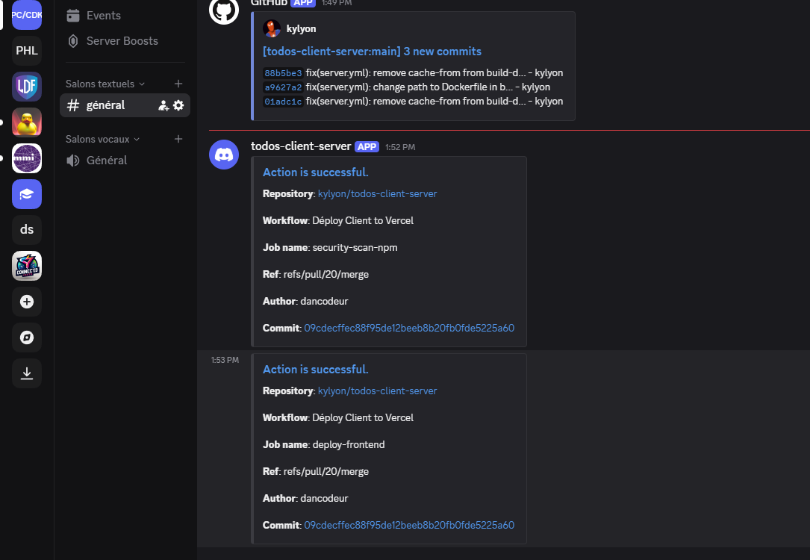
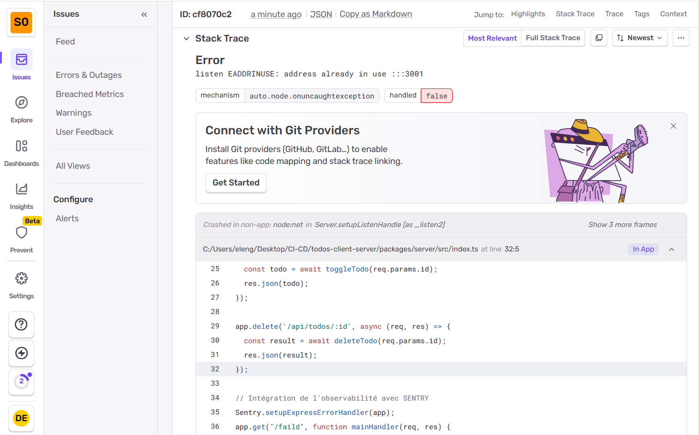

# Todos-client-server
Projet CI/CD – Mastère Lead Developer Full Stack

Ce projet implémente une architecture **client / serveur** complète avec pipeline CI/CD, observabilité via **Sentry**, et notifications automatisées **Discord**.  
Le repository contient deux applications distinctes dans le dossier `packages/` :

- `packages/client` → Frontend (Vite + React)  
- `packages/server` → Backend (Node.js + Express, Dockerfile inclu)

---

## Fonctionnalité 

#### Notifications Discord  : [Lien du serveur discord](https://discord.gg/u9fnSswM)
Le backend envoie automatiquement des alertes Discord en cas d’erreur ou d’événements critiques.



### Observabilité Sentry 
###
#### Dashboard UI
Le backend est relié à **Sentry** pour remonter les erreurs, logs et événements importants coté serveur et client.


#### Webhook 
```shell
https://todos-server-node.onrender.com/failed
```
##### Exemple de réponse 

## Website

#### Frontend : 

1. URL : [lien ici](https://todos-client-server-two.vercel.app/)
2. Stack: Vite, React 
3. Déploiement : Vercel
4. Docker : Dockerfile disponible dans `packages/client`

#### Backend :
1. URL : [lien ici ](https://todos-server-node.onrender.com/api/todos)

2. Stack : Node.js, Express
3. Déploiement : Render
4. Docker : Dockerfile disponible dans `packages/server`

## Structure du repository
```
.
├──.github/
│    ├── workflows/
|    | client.yml
|    | server.yml
|
├── packages/
│   ├── client/      
│   │   ├── public/
│   │   └── src/
│   │
│   └── server/      
│       ├── public/
│       ├── src/
│       └── Dockerfile
│
├──.gitignore
|
└── README.md
```

## Lancement du backend avec Docker
```bash
docker build -t todos-server .
docker run -p 3001:3001 todos-server
```
## Auteur
- Kyllian Marie-Magdelaine
- Dan David Elenga
